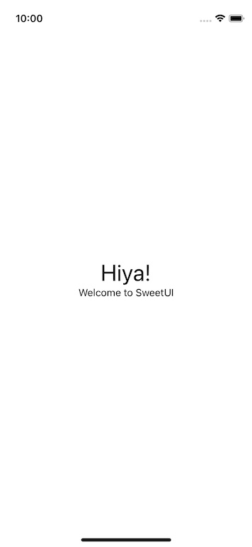

# SweetUI 🍬

SweetUI adds a little sugar to UIKit. Goals:

- Thin abstraction on top of UIKit
- Banish storyboards and nibs
- Declarative style for `UIView` subclassing 
- Reduce boiler plate code for `UIViewController` subclasses

Let's dig into each of these points. The core of SweetUI only depends on UIKit and Foundation and there are few methods to integrate with Combine


## Examples

The follow code is all that's required to create a view controller and its view:

```
import UIKit
import SweetUI


class FormViewController: ViewController {

    let rootView = ZStack(alignment: .center) {
        VStack(alignment: .center) {
            UILabel()
                .font(.preferredFont(forTextStyle: .largeTitle))
                .text("Hiya!")
            UILabel()
                .font(.preferredFont(forTextStyle: .subheadline))
                .text("Welcome to SweetUI")
        }
    }
    .backgroundColor(.systemBackground)
}
``` 



The demo app illustrates:
- Extract the view to a `View` subclass
- Communicating with the `View` via a `ViewModel` 
- Constructing a `View`'s layout that:
    - Abstract a layout to a `LayoutView` subclass
    - Uses Combine for state management
    - Keyboard avoidance
- A `FlowController`, specifically `NavigationFlowController`  


# Miscellaneous Notes

## Fixes for `Circular reference` error

1. Create a method on the root object
2. Communicate the data via a Combine Publisher


## Adding `ViewBodyProvider` to an existing view

class CustomControl: UIControl, ViewBodyProvider {

    let body = UILabel()
        .text("Hiya!")

    init() {
        super.init(frame: .zero)
        initializeBody()
    }

    required init?(coder: NSCoder) {
        fatalError("init(coder:) has not been implemented")
    }
}


## How to replace main.storyboard with code

TODO: 
